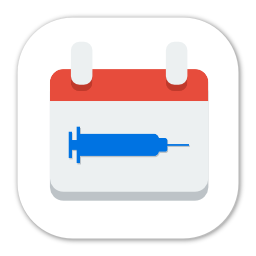

<div align="center">
	
	<h1>💉 BC COVID-19 Vaccine Appointment Finder</h1>
	<p>
		<b>Find a vaccine appointment in British Columbia near you.</b>
	</p>
	<br>
	<br>
	<br>
</div>

To find a vaccine appointment in BC if you have one booked requires canceling the existing one. This tool allows finding all available vaccine appointments in a specified city in BC without canceling the existing time slot. I wrote about this in detail [in my blog post](https://den.dev/blog/vaccine/).

## Running

To run the application, you will need to create a `tokens.json` file in the project folder, that matches the following content:

```json
{
	"fwuid": "YOUR_FWUID_HERE",
	"appid": "YOUR_APPID_HERE"
}
```

You can get both values when you navigate to `https://www.getvaccinated.gov.bc.ca/s/booking`, and looking at the traffic through the network inspector in your favorite web browser. Look for `aura.context` form data in a POST request.

## FAQ

### Does this tool allow me to pick which vaccine I will get?

No. This is determined by the BC government.

### Does this tool guarantee an appointment slot?

No. It only shows available times at the time of the query.

### Does this tool allow me to book an appointment?

No. It only shows available times. To book an appointment, you will need to [register for a vaccination](https://www2.gov.bc.ca/gov/content/covid-19/vaccine/register).

### Does this tool require me to provide any personally identifiable information?

No. The tool only queries the official BC vaccination appointment service to get the times. That's it. No telemetry, no data being collected.

### The tool showed an available time slot, but when I cancelled and went to register, it was gone. Why is that?

The tool only shows available times at the time of the query. Between running the application and booking a new appointment, the time slot might be gone. As mentioned earlier, the tool does not guarantee an appointment.